# Data Flow Diagrams

## System Overview Data Flow

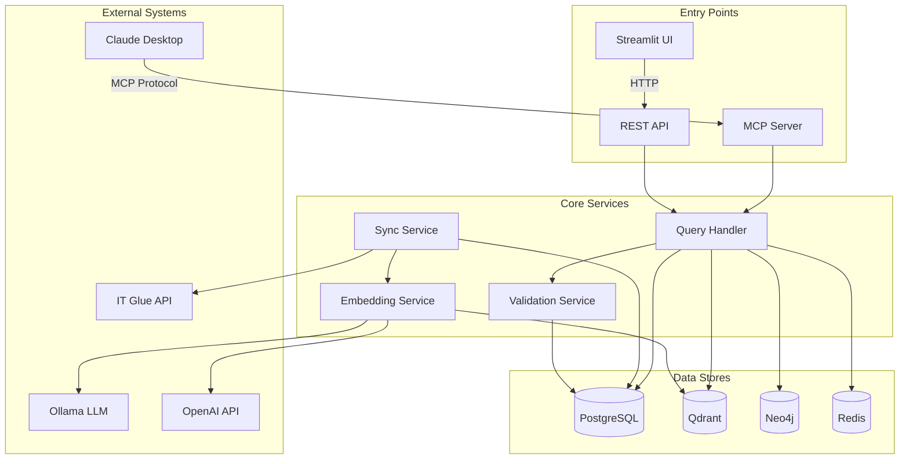

## Query Processing Flow

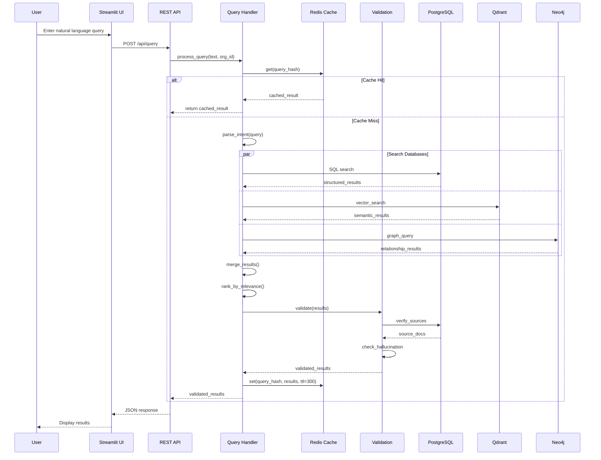

## Data Synchronization Flow

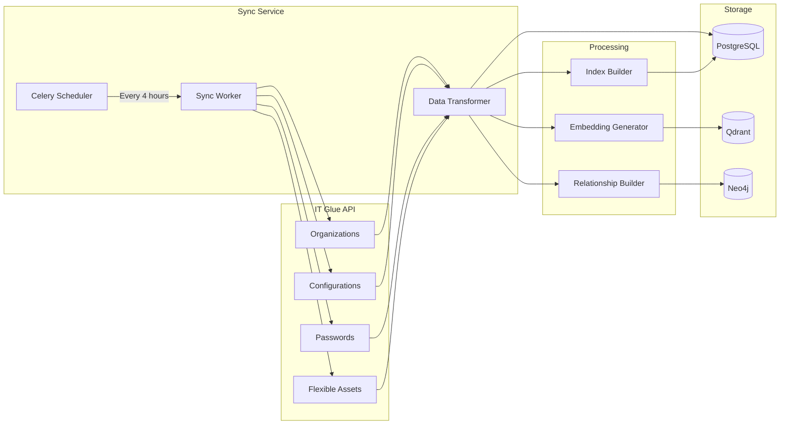

## MCP Protocol Flow

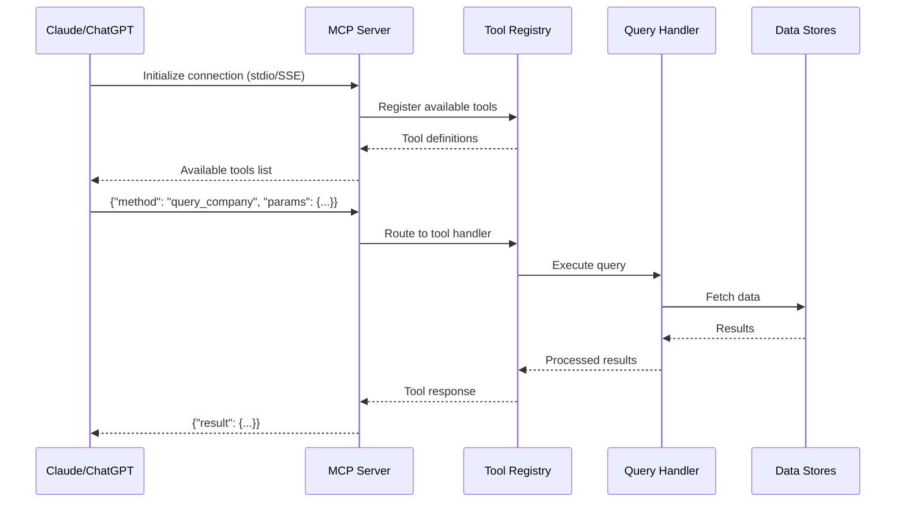

## Embedding Generation Flow

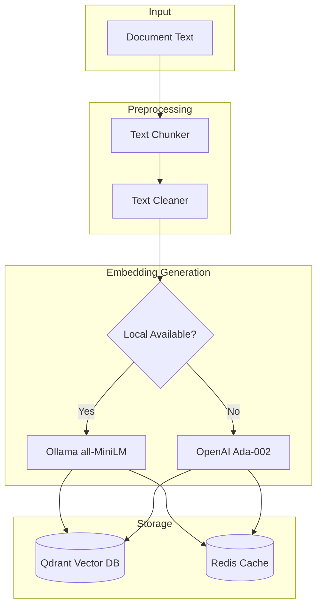

## Authentication & Authorization Flow

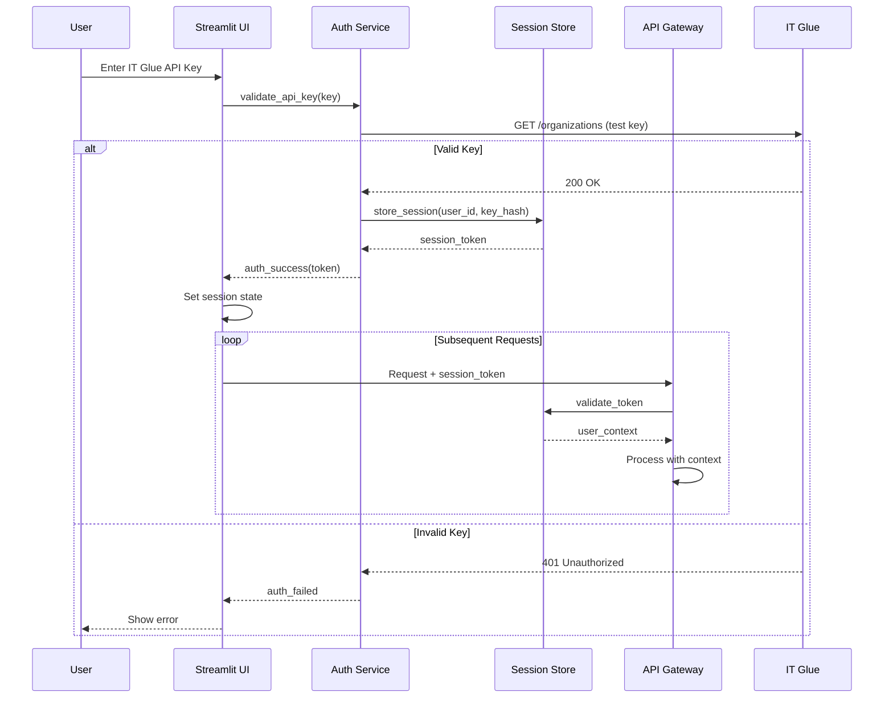

## Caching Strategy Flow

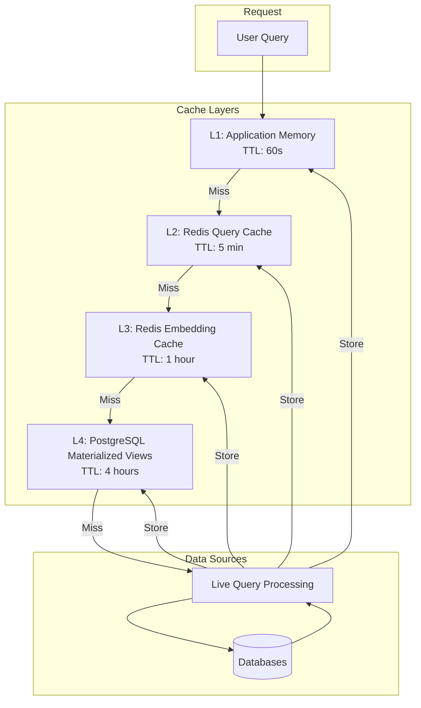

## Error Handling Flow

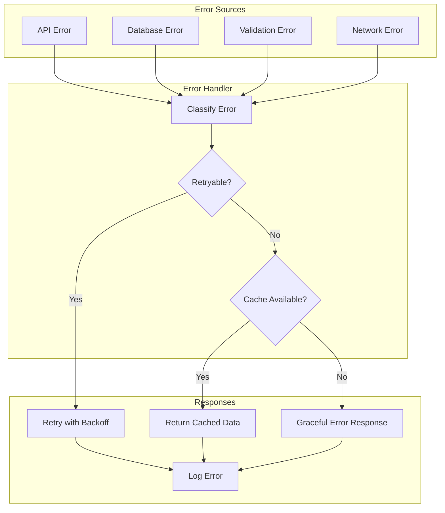

## Data Validation Flow

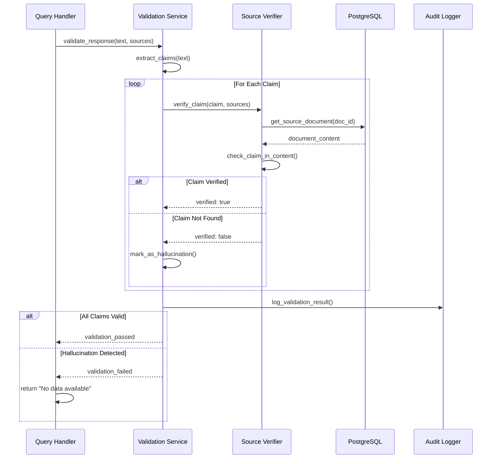

## Performance Monitoring Flow

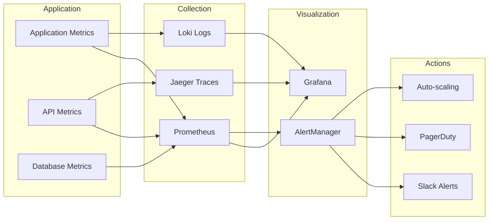

## Data Privacy & Compliance Flow

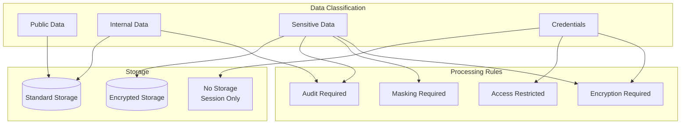

---

## Key Data Flow Principles

1. **Cache First**: Always check cache before expensive operations
2. **Parallel Processing**: Execute independent queries concurrently
3. **Fail Fast**: Validate early in the pipeline
4. **Graceful Degradation**: Use cached/stale data when services unavailable
5. **Audit Everything**: Log all data access for compliance
6. **Zero Trust**: Validate at every boundary
7. **Async Where Possible**: Use async operations for I/O bound tasks

## Performance Targets

- Query Response: < 2 seconds (95th percentile)
- Cache Hit Rate: > 60%
- Sync Completion: < 30 minutes for full org
- Embedding Generation: < 100ms per document
- Validation: < 50ms per response

## Data Retention

- Query Cache: 5 minutes
- Embedding Cache: 1 hour  
- Session Data: 24 hours
- Audit Logs: 90 days
- Sync History: 30 days
- Error Logs: 7 days