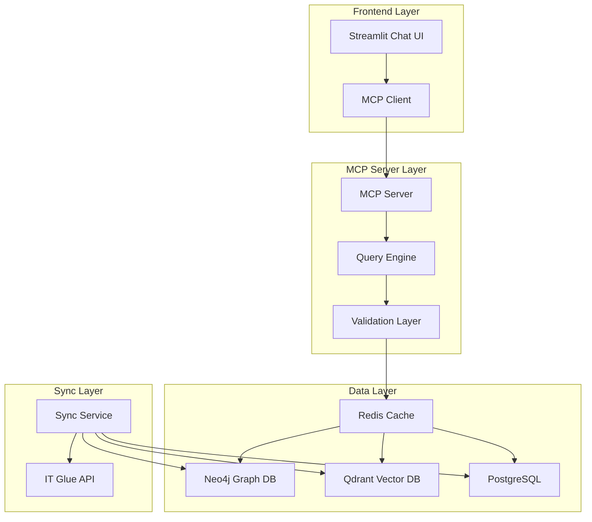
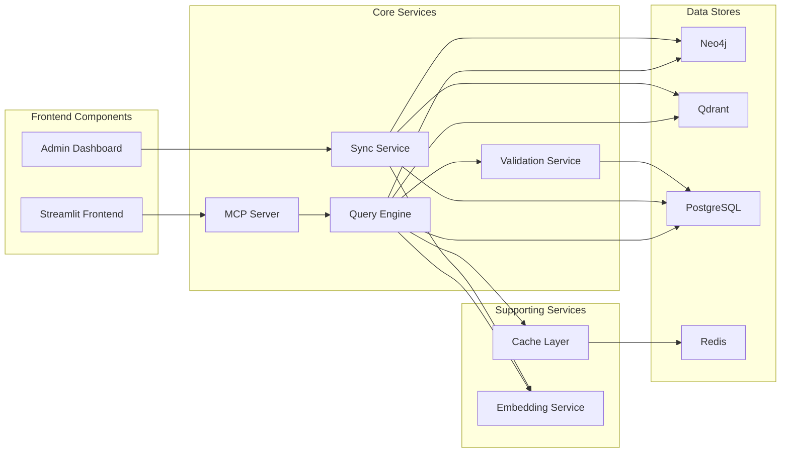
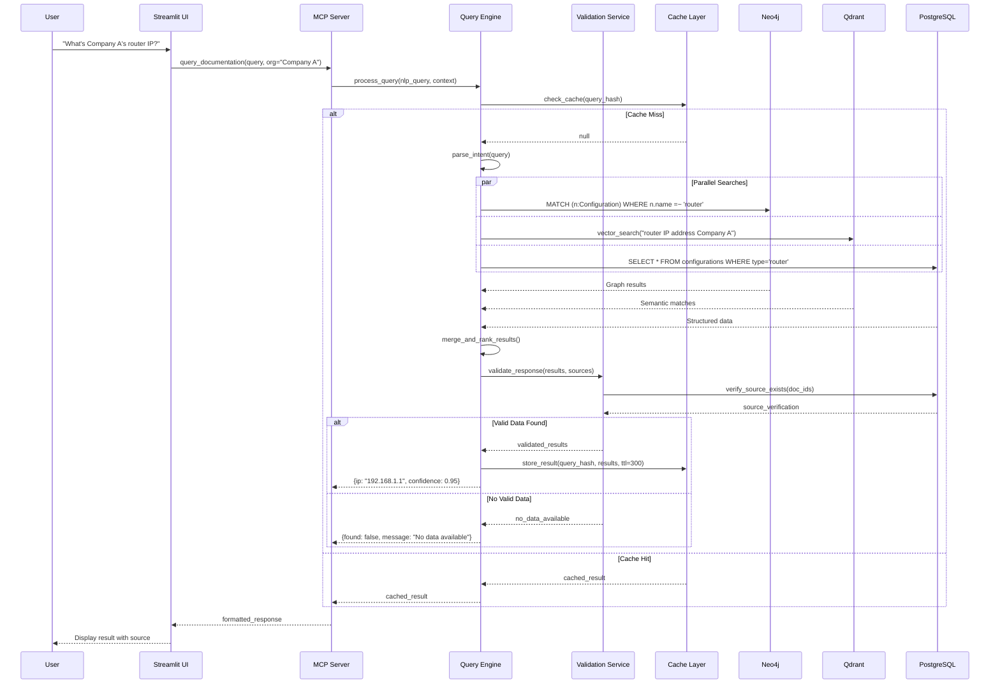
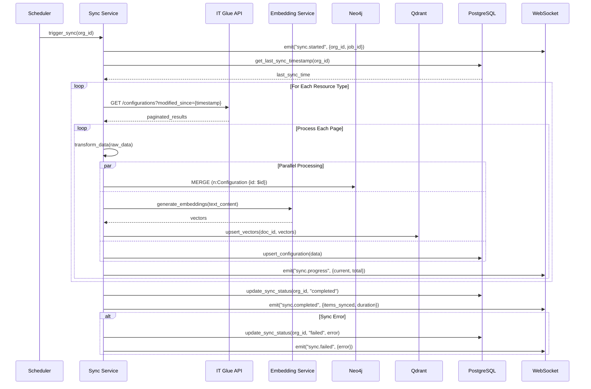
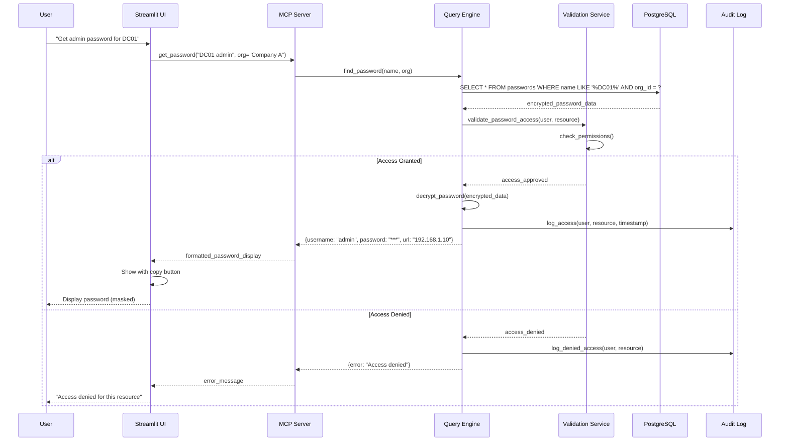
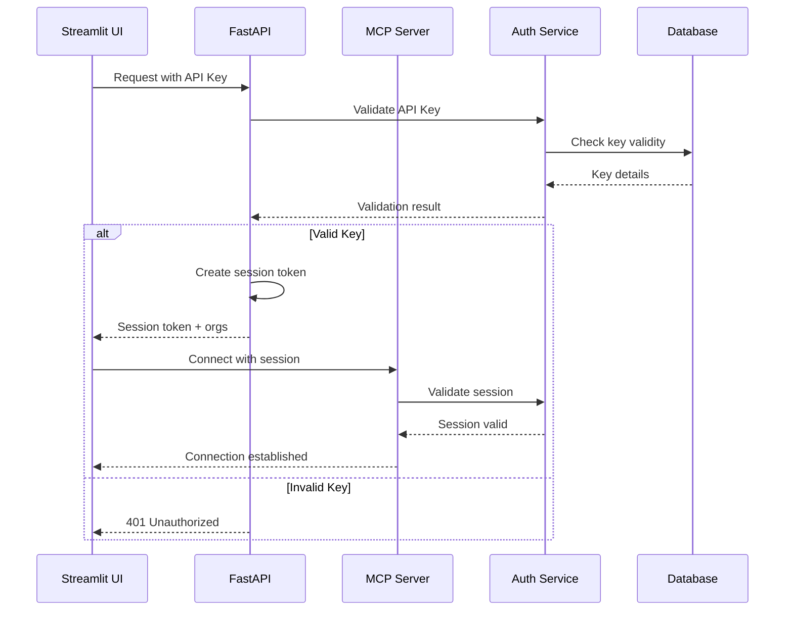
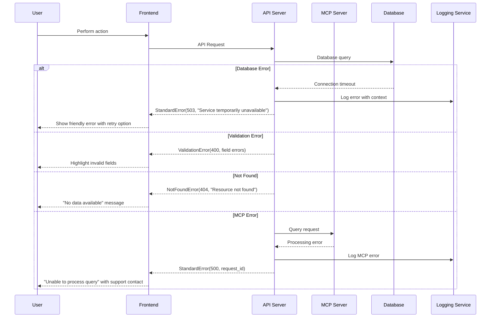

# IT Glue MCP Server Fullstack Architecture Document

## Introduction

This document outlines the complete fullstack architecture for the IT Glue MCP Server, including backend systems, frontend implementation, and their integration. It serves as the single source of truth for AI-driven development, ensuring consistency across the entire technology stack.

This unified approach combines what would traditionally be separate backend and frontend architecture documents, streamlining the development process for modern fullstack applications where these concerns are increasingly intertwined.

### Starter Template or Existing Project

**Python MCP API Starter** was selected as the foundation, providing:
- Production-ready MCP protocol implementation
- Built-in patterns for authentication and caching
- Docker Compose configuration for local development
- Streamlit integration for rapid UI prototyping

The starter template has been extended with:
- Neo4j graph database integration for relationship modeling
- Qdrant vector database for semantic search
- IT Glue API client with rate limiting
- Redis caching layer for performance

### Change Log

| Date | Version | Description | Author |
|------|---------|-------------|--------|
| 2025-01-30 | 1.0 | Initial fullstack architecture document | Architect |

## High Level Architecture

### Technical Summary

The IT Glue MCP Server employs a microservices architecture with Python-based backend services and a Streamlit frontend for MVP, designed for local Docker deployment. The backend integrates with IT Glue's REST API to sync documentation into Neo4j for relationship modeling and Qdrant for semantic search, while the frontend provides a chat-based interface for natural language queries. The MCP protocol enables seamless integration between the query interface and the intelligent backend services, with Redis caching ensuring sub-2-second response times. This architecture achieves the PRD's goal of transforming unstructured IT documentation into an instantly-accessible knowledge base with zero hallucination through strict validation layers.

### Platform and Infrastructure Choice

**Platform:** Docker Compose (Local Infrastructure)
**Key Services:** Neo4j, Qdrant, PostgreSQL, Redis, Streamlit, Python MCP Server
**Deployment Host and Regions:** On-premises servers in primary datacenter

### Repository Structure

**Structure:** Monorepo
**Monorepo Tool:** Python workspaces with shared packages
**Package Organization:** Separate packages for mcp-server, sync-service, api-layer, frontend, and shared utilities

### High Level Architecture Diagram



### Architectural Patterns

- **Microservices Architecture:** Separate services for MCP, sync, and query processing - *Rationale:* Enables independent scaling and failure isolation for critical components
- **Event-Driven Sync:** Async processing of IT Glue data updates - *Rationale:* Prevents API rate limiting from blocking user queries
- **Repository Pattern:** Abstract data access through unified interfaces - *Rationale:* Allows switching between Neo4j, Qdrant, and PostgreSQL transparently
- **Cache-Aside Pattern:** Redis caching with lazy loading - *Rationale:* Optimizes for read-heavy workload while maintaining data freshness
- **Zero-Trust Validation:** Every query result validated against source - *Rationale:* Ensures 100% accuracy requirement from PRD
- **Component-Based UI:** Reusable Streamlit components - *Rationale:* Rapid prototyping while maintaining consistency
- **API Gateway Pattern:** MCP server as single entry point - *Rationale:* Centralized authentication, rate limiting, and monitoring

## Tech Stack

This is the DEFINITIVE technology selection for the entire IT Glue MCP Server project. All development must use these exact versions.

### Technology Stack Table

| Category | Technology | Version | Purpose | Rationale |
|----------|------------|---------|---------|-----------|
| Frontend Language | Python | 3.11+ | Streamlit app development | Consistency with backend, rapid prototyping |
| Frontend Framework | Streamlit | 1.31+ | Chat UI and admin interface | Fastest path to MVP with built-in components |
| UI Component Library | Streamlit Components | Latest | Custom widgets and displays | Native integration, no additional complexity |
| State Management | Streamlit Session State | Built-in | User session and query history | Simple, sufficient for MVP scope |
| Backend Language | Python | 3.11+ | MCP server and services | Excellent library ecosystem, MCP SDK support |
| Backend Framework | FastAPI | 0.109+ | API endpoints and async support | Modern, fast, automatic OpenAPI docs |
| API Style | REST + MCP | MCP 1.0 | Mixed API approach | REST for sync, MCP for chat integration |
| Database | Neo4j | 5.15+ | Graph relationships | Optimal for IT infrastructure modeling |
| Cache | Redis | 7.2+ | Query result caching | Sub-second response times |
| File Storage | Local FS | N/A | Document storage | Simplified deployment, no cloud deps |
| Authentication | API Keys | Custom | Service authentication | Simple, secure for internal use |
| Frontend Testing | Pytest | 8.0+ | Unit and integration tests | Unified testing framework |
| Backend Testing | Pytest | 8.0+ | API and service tests | Consistent with frontend |
| E2E Testing | Playwright | 1.41+ | End-to-end testing | Modern, supports Streamlit |
| Build Tool | Poetry | 1.7+ | Dependency management | Better than pip, lock file support |
| Bundler | N/A | N/A | Not needed for Streamlit | Streamlit handles bundling |
| IaC Tool | Docker Compose | 2.23+ | Container orchestration | Simple, sufficient for local deployment |
| CI/CD | GitHub Actions | Latest | Automated testing and deployment | Free, integrated with repository |
| Monitoring | Langfuse | 2.0+ | LLM observability | Tracks query performance and accuracy |
| Logging | Python Logging + Loki | 2.9+ | Centralized logging | Structured logs with Grafana integration |
| CSS Framework | Streamlit Theming | Built-in | UI styling | Native theming system |

### Additional Technology Components

| Category | Technology | Version | Purpose | Rationale |
|----------|------------|---------|---------|-----------|
| Vector Database | Qdrant | 1.7+ | Semantic search | Self-hosted, excellent Python SDK |
| Relational DB | PostgreSQL | 16+ | Structured data, Supabase backend | Robust, supports JSON fields |
| Message Queue | Redis Streams | Built-in | Event processing | Simpler than RabbitMQ/Kafka for MVP |
| API Client | HTTPX | 0.26+ | IT Glue API integration | Async support, better than requests |
| MCP SDK | mcp-python | 1.0+ | MCP protocol implementation | Official Anthropic SDK |
| Embeddings | SentenceTransformers | 2.3+ | Text embeddings | Local, no API costs |
| Data Validation | Pydantic | 2.5+ | Schema validation | Type safety, automatic validation |
| Task Queue | Celery | 5.3+ | Background job processing | Reliable async task execution |

## Data Models

### Organization

**Purpose:** Represents an IT Glue organization (client company) with all its associated documentation and assets

**Key Attributes:**
- id: int - Unique IT Glue organization ID
- name: string - Organization display name
- sync_status: SyncStatus - Current synchronization state
- last_synced: datetime - Last successful sync timestamp
- settings: JsonObject - Organization-specific configuration

**TypeScript Interface:**
```typescript
interface Organization {
  id: number;
  name: string;
  syncStatus: 'pending' | 'syncing' | 'completed' | 'failed';
  lastSynced: Date | null;
  settings: Record<string, any>;
}
```

**Relationships:**
- Has many Configurations
- Has many FlexibleAssets
- Has many Documents
- Has many Passwords

### Configuration

**Purpose:** Represents IT infrastructure configurations (servers, workstations, networks) with standardized properties

**Key Attributes:**
- id: int - Unique configuration ID
- organization_id: int - Parent organization
- name: string - Configuration name
- configuration_type: string - Type (server, workstation, network, etc.)
- ip_address: string | null - Primary IP address
- attributes: JsonObject - Type-specific attributes
- relationships: JsonObject - Links to other configurations

**TypeScript Interface:**
```typescript
interface Configuration {
  id: number;
  organizationId: number;
  name: string;
  configurationType: 'server' | 'workstation' | 'network' | 'firewall' | 'other';
  ipAddress: string | null;
  attributes: Record<string, any>;
  relationships: {
    parentId?: number;
    childIds?: number[];
  };
}
```

**Relationships:**
- Belongs to Organization
- Has parent/child relationships with other Configurations
- Referenced by Documents

### FlexibleAsset

**Purpose:** Represents customizable IT Glue assets with dynamic schemas (printers, applications, licenses, etc.)

**Key Attributes:**
- id: int - Unique asset ID
- organization_id: int - Parent organization
- flexible_asset_type_id: int - Defines the schema
- name: string - Asset display name
- traits: JsonObject - Dynamic attributes based on type
- embeddings: float[] - Vector representation for semantic search

**TypeScript Interface:**
```typescript
interface FlexibleAsset {
  id: number;
  organizationId: number;
  flexibleAssetTypeId: number;
  name: string;
  traits: Record<string, any>;
  embeddings?: number[];
}
```

**Relationships:**
- Belongs to Organization
- Has schema defined by FlexibleAssetType
- Can reference Configurations
- Searchable via embeddings

### Password

**Purpose:** Stores encrypted credentials with access context and related resources

**Key Attributes:**
- id: int - Unique password ID
- organization_id: int - Parent organization
- name: string - Password entry name
- username: string - Login username
- password_encrypted: string - Encrypted password value
- url: string | null - Associated URL/system
- resource_type: string - Type of resource (application, device, service)
- notes: string | null - Additional context

**TypeScript Interface:**
```typescript
interface Password {
  id: number;
  organizationId: number;
  name: string;
  username: string;
  passwordEncrypted: string;
  url: string | null;
  resourceType: string;
  notes: string | null;
}
```

**Relationships:**
- Belongs to Organization
- Can be associated with Configurations
- Can be associated with FlexibleAssets

### Document

**Purpose:** Represents knowledge base articles, runbooks, and general documentation with full-text search capability

**Key Attributes:**
- id: int - Unique document ID
- organization_id: int - Parent organization
- name: string - Document title
- content: string - Document body (markdown/HTML)
- document_type: string - Category (runbook, sop, guide, note)
- embeddings: float[] - Vector representation
- created_at: datetime - Creation timestamp
- updated_at: datetime - Last modification

**TypeScript Interface:**
```typescript
interface Document {
  id: number;
  organizationId: number;
  name: string;
  content: string;
  documentType: 'runbook' | 'sop' | 'guide' | 'note' | 'other';
  embeddings?: number[];
  createdAt: Date;
  updatedAt: Date;
}
```

**Relationships:**
- Belongs to Organization
- Can reference multiple Configurations
- Can reference multiple FlexibleAssets
- Searchable via embeddings and full-text

### QueryContext

**Purpose:** Maintains conversation context and query history for intelligent follow-up questions

**Key Attributes:**
- session_id: string - Unique session identifier
- organization_id: int | null - Scoped organization context
- query: string - User's natural language query
- response: JsonObject - Structured response data
- confidence: float - Result confidence score
- timestamp: datetime - Query timestamp

**TypeScript Interface:**
```typescript
interface QueryContext {
  sessionId: string;
  organizationId: number | null;
  query: string;
  response: {
    found: boolean;
    data: any;
    source: string;
    confidence: number;
  };
  confidence: number;
  timestamp: Date;
}
```

**Relationships:**
- Belongs to a user session
- May reference an Organization
- Forms a conversation chain with other QueryContexts

## API Specification

### REST API Specification

```yaml
openapi: 3.0.0
info:
  title: IT Glue MCP Server API
  version: 1.0.0
  description: Administrative and sync API for IT Glue MCP Server
servers:
  - url: http://localhost:8000/api/v1
    description: Local development server

paths:
  /health:
    get:
      summary: Health check endpoint
      responses:
        '200':
          description: Service healthy
          content:
            application/json:
              schema:
                type: object
                properties:
                  status: 
                    type: string
                    example: healthy
                  services:
                    type: object
                    properties:
                      neo4j: boolean
                      qdrant: boolean
                      redis: boolean
                      postgres: boolean

  /organizations:
    get:
      summary: List all organizations
      parameters:
        - name: sync_status
          in: query
          schema:
            type: string
            enum: [pending, syncing, completed, failed]
      responses:
        '200':
          description: List of organizations
          content:
            application/json:
              schema:
                type: array
                items:
                  $ref: '#/components/schemas/Organization'

  /organizations/{orgId}/sync:
    post:
      summary: Trigger organization sync
      parameters:
        - name: orgId
          in: path
          required: true
          schema:
            type: integer
      requestBody:
        content:
          application/json:
            schema:
              type: object
              properties:
                full_sync:
                  type: boolean
                  default: false
                types:
                  type: array
                  items:
                    type: string
                    enum: [configurations, flexible_assets, passwords, documents]
      responses:
        '202':
          description: Sync job queued
          content:
            application/json:
              schema:
                type: object
                properties:
                  job_id: string
                  status: string

  /search:
    post:
      summary: Search across all data types
      requestBody:
        content:
          application/json:
            schema:
              type: object
              required: [query]
              properties:
                query:
                  type: string
                organization_id:
                  type: integer
                types:
                  type: array
                  items:
                    type: string
                limit:
                  type: integer
                  default: 10
      responses:
        '200':
          description: Search results
          content:
            application/json:
              schema:
                type: object
                properties:
                  results:
                    type: array
                    items:
                      type: object
                      properties:
                        type: string
                        id: integer
                        name: string
                        relevance: number
                        highlight: string

components:
  schemas:
    Organization:
      type: object
      properties:
        id: integer
        name: string
        sync_status: string
        last_synced: string
        settings: object
```

### MCP Protocol Implementation

The MCP server exposes the following tools for chat interactions:

```typescript
// MCP Tool Definitions
interface MCPTools {
  // Primary query tool
  "query_documentation": {
    description: "Search IT Glue documentation using natural language",
    parameters: {
      query: string;
      organization?: string;  // Organization name or ID
      include_types?: Array<"configurations" | "assets" | "passwords" | "documents">;
    }
  },

  // Specific lookup tools
  "get_password": {
    description: "Retrieve specific password by name or system",
    parameters: {
      name: string;
      organization: string;
      system?: string;
    }
  },

  "get_configuration": {
    description: "Get configuration details for a device",
    parameters: {
      device_name: string;
      organization: string;
      detail_level?: "summary" | "full";
    }
  },

  "find_ip_address": {
    description: "Find IP addresses for devices or services",
    parameters: {
      device_or_service: string;
      organization: string;
    }
  },

  // Relationship queries
  "get_dependencies": {
    description: "Find dependencies and relationships",
    parameters: {
      resource_name: string;
      organization: string;
      depth?: number;  // How many levels deep
    }
  },

  // Cross-organization intelligence (Phase 2)
  "find_similar_issues": {
    description: "Find similar issues across organizations",
    parameters: {
      issue_description: string;
      exclude_org?: string;
      limit?: number;
    }
  }
}

// MCP Response Format
interface MCPResponse {
  success: boolean;
  data?: any;
  error?: {
    code: string;
    message: string;
  };
  metadata: {
    query_time_ms: number;
    sources: string[];
    confidence: number;
  };
}
```

### WebSocket Events (Real-time Updates)

```typescript
// WebSocket event definitions for real-time sync status
interface WebSocketEvents {
  // Server -> Client
  "sync.started": {
    organization_id: number;
    job_id: string;
    types: string[];
  },
  
  "sync.progress": {
    organization_id: number;
    job_id: string;
    current: number;
    total: number;
    current_type: string;
  },
  
  "sync.completed": {
    organization_id: number;
    job_id: string;
    items_synced: number;
    duration_ms: number;
  },
  
  "sync.failed": {
    organization_id: number;
    job_id: string;
    error: string;
  }
}
```

## Components

### MCP Server Component

**Responsibility:** Implements the Model Context Protocol to handle natural language queries from chat clients, orchestrating the query engine and validation layers to return accurate documentation

**Key Interfaces:**
- MCP stdio interface for chat client communication
- Query tool registration and parameter validation
- Session management for conversation context
- Response formatting with confidence scores

**Dependencies:** Query Engine, Validation Service, Cache Layer, Session Store

**Technology Stack:** Python 3.11+, mcp-python SDK, FastAPI for health endpoints, Pydantic for validation

### Query Engine Component

**Responsibility:** Processes natural language queries by orchestrating searches across Neo4j (relationships), Qdrant (semantic), and PostgreSQL (structured data) to find relevant documentation

**Key Interfaces:**
- Natural language query parsing and intent detection
- Multi-database query orchestration
- Result ranking and relevance scoring
- Query optimization and caching strategies

**Dependencies:** Neo4j Database, Qdrant Vector DB, PostgreSQL, Redis Cache, Embedding Service

**Technology Stack:** Python 3.11+, LangChain for query parsing, SentenceTransformers for embeddings, AsyncIO for parallel queries

### Sync Service Component

**Responsibility:** Periodically synchronizes data from IT Glue API into local databases, managing rate limits, incremental updates, and data transformation

**Key Interfaces:**
- IT Glue API pagination and rate limit handling
- Data transformation and normalization
- Incremental vs full sync logic
- Sync job scheduling and monitoring

**Dependencies:** IT Glue API, Neo4j Database, Qdrant Vector DB, PostgreSQL, Message Queue

**Technology Stack:** Python 3.11+, Celery for job scheduling, HTTPX for async API calls, Redis for job queue

### Validation Service Component

**Responsibility:** Ensures zero hallucination by validating all query responses against source data, returning "no data available" when information cannot be verified

**Key Interfaces:**
- Response validation against source documents
- Confidence score calculation
- Fact-checking and cross-reference verification
- Audit logging for validation decisions

**Dependencies:** PostgreSQL (source tracking), Cache Layer

**Technology Stack:** Python 3.11+, Custom validation rules engine, Structured logging

### Streamlit Frontend Component

**Responsibility:** Provides the chat interface for users to query documentation, select organizations, and view formatted responses with source attribution

**Key Interfaces:**
- Chat message input and display
- Organization selector dropdown
- Response formatting with syntax highlighting
- Copy-to-clipboard for passwords/configs
- Session state management

**Dependencies:** MCP Client Library, WebSocket Connection (for sync status)

**Technology Stack:** Python 3.11+, Streamlit 1.31+, streamlit-chat for message UI, streamlit-ace for code display

### Admin Dashboard Component

**Responsibility:** Provides administrative interface for monitoring sync status, managing organizations, and viewing system metrics

**Key Interfaces:**
- Organization sync triggering and monitoring
- System health visualization
- Query analytics and popular searches
- Error log viewing and debugging

**Dependencies:** REST API, WebSocket Connection, Monitoring Service

**Technology Stack:** Streamlit 1.31+, Plotly for charts, streamlit-aggrid for data tables

### Cache Layer Component

**Responsibility:** Manages Redis-based caching for query results, organization data, and frequently accessed configurations to ensure sub-2-second response times

**Key Interfaces:**
- Cache key generation and invalidation
- TTL management based on data type
- Cache warming for popular queries
- Memory usage monitoring

**Dependencies:** Redis, Query Engine (for cache misses)

**Technology Stack:** Redis 7.2+, Python redis-py client, Cache-aside pattern implementation

### Embedding Service Component

**Responsibility:** Generates vector embeddings for documents and queries using local transformer models, enabling semantic search capabilities

**Key Interfaces:**
- Text preprocessing and chunking
- Batch embedding generation
- Model loading and management
- Embedding dimension validation

**Dependencies:** Local file system (for models), GPU/CPU resources

**Technology Stack:** SentenceTransformers 2.3+, all-MiniLM-L6-v2 model, PyTorch backend

### Component Interaction Diagram



## External APIs

### IT Glue API

- **Purpose:** Primary data source for all IT documentation, configurations, passwords, and flexible assets
- **Documentation:** https://api.itglue.com/developer
- **Base URL(s):** https://api.itglue.com
- **Authentication:** Bearer token (API key in header: `x-api-key`)
- **Rate Limits:** 10,000 requests per day, 10 requests per second

**Key Endpoints Used:**
- `GET /organizations` - Retrieve all organizations
- `GET /organizations/{id}/relationships/configurations` - Get configurations for an org
- `GET /flexible_assets` - Retrieve flexible assets with pagination
- `GET /passwords` - Get password entries (filtered by org)
- `GET /documents` - Retrieve knowledge base articles
- `GET /configuration_types` - Get configuration type definitions
- `GET /flexible_asset_types` - Get flexible asset schemas

**Integration Notes:** 
- Must implement exponential backoff for rate limit handling
- Use field sparse fieldsets (`fields[configurations]=id,name,ip`) to reduce payload size
- Implement cursor-based pagination for large datasets
- Cache organization list as it rarely changes
- Password endpoints require additional encryption handling

### OpenAI API (Optional - Phase 2)

- **Purpose:** Enhanced embeddings and query understanding for complex natural language queries
- **Documentation:** https://platform.openai.com/docs/api-reference
- **Base URL(s):** https://api.openai.com/v1
- **Authentication:** Bearer token with API key
- **Rate Limits:** Based on tier, typically 3,500 RPM for embeddings

**Key Endpoints Used:**
- `POST /embeddings` - Generate text embeddings using text-embedding-3-small
- `POST /chat/completions` - Query refinement and intent clarification

**Integration Notes:**
- Only used when local models insufficient for query understanding
- Implement fallback to local embeddings if API unavailable
- Never send sensitive data (passwords, IPs) to OpenAI
- Cost monitoring required - approximately $0.00002 per 1K tokens

### Microsoft Graph API (Future - Phase 3)

- **Purpose:** Integration with Azure AD for user authentication and compliance checking
- **Documentation:** https://docs.microsoft.com/en-us/graph/api/overview
- **Base URL(s):** https://graph.microsoft.com/v1.0
- **Authentication:** OAuth 2.0 with client credentials flow
- **Rate Limits:** 2000 requests per second per app

**Key Endpoints Used:**
- `GET /users` - Validate user access permissions
- `GET /devices` - Check Autopilot enrollment status
- `GET /deviceManagement/managedDevices` - Intune compliance status

**Integration Notes:**
- Will require Azure AD app registration per tenant
- Implement token caching with refresh logic
- Scope permissions to read-only access
- Consider Microsoft Graph SDK for Python

## Core Workflows

### Natural Language Query Workflow



### Data Synchronization Workflow



### Password Retrieval Workflow



### Cross-Organization Pattern Search (Phase 2)

```mermaid
sequenceDiagram
    participant U as User
    participant UI as Streamlit UI
    participant MCP as MCP Server
    participant QE as Query Engine
    participant QDRANT as Qdrant
    participant NEO as Neo4j
    participant ML as ML Service

    U->>UI: "Find similar printer issues across all clients"
    UI->>MCP: find_similar_issues("printer connectivity problems")
    MCP->>QE: cross_org_search(query)
    
    QE->>QDRANT: vector_search(query_embedding, exclude_org=null)
    QDRANT-->>QE: similar_documents[]
    
    QE->>NEO: MATCH (d:Document)-[:FIXES]->(c:Configuration)
    NEO-->>QE: fix_patterns[]
    
    QE->>ML: extract_patterns(documents)
    ML-->>QE: common_patterns[]
    
    QE->>QE: group_by_solution_type()
    QE->>QE: calculate_success_rates()
    
    QE-->>MCP: {
        patterns: [
            {issue: "Print spooler", 
             solution: "Restart service", 
             success_rate: 0.87,
             occurrences: 23}
        ]
    }
    
    MCP-->>UI: formatted_patterns
    UI-->>U: Display pattern analysis
```

## Database Schema

### PostgreSQL Schema (Primary Structured Data)

```sql
-- Organizations table
CREATE TABLE organizations (
    id INTEGER PRIMARY KEY,
    name VARCHAR(255) NOT NULL,
    sync_status VARCHAR(20) DEFAULT 'pending' 
        CHECK (sync_status IN ('pending', 'syncing', 'completed', 'failed')),
    last_synced TIMESTAMP,
    settings JSONB DEFAULT '{}',
    created_at TIMESTAMP DEFAULT CURRENT_TIMESTAMP,
    updated_at TIMESTAMP DEFAULT CURRENT_TIMESTAMP
);

CREATE INDEX idx_org_sync_status ON organizations(sync_status);
CREATE INDEX idx_org_settings ON organizations USING GIN (settings);

-- Configurations table
CREATE TABLE configurations (
    id INTEGER PRIMARY KEY,
    organization_id INTEGER NOT NULL REFERENCES organizations(id),
    name VARCHAR(255) NOT NULL,
    configuration_type VARCHAR(50) NOT NULL,
    ip_address INET,
    attributes JSONB DEFAULT '{}',
    relationships JSONB DEFAULT '{}',
    created_at TIMESTAMP DEFAULT CURRENT_TIMESTAMP,
    updated_at TIMESTAMP DEFAULT CURRENT_TIMESTAMP
);

CREATE INDEX idx_config_org ON configurations(organization_id);
CREATE INDEX idx_config_type ON configurations(configuration_type);
CREATE INDEX idx_config_ip ON configurations(ip_address);
CREATE INDEX idx_config_attrs ON configurations USING GIN (attributes);

-- Flexible Assets table
CREATE TABLE flexible_assets (
    id INTEGER PRIMARY KEY,
    organization_id INTEGER NOT NULL REFERENCES organizations(id),
    flexible_asset_type_id INTEGER NOT NULL,
    name VARCHAR(255) NOT NULL,
    traits JSONB DEFAULT '{}',
    embeddings VECTOR(1536),
    created_at TIMESTAMP DEFAULT CURRENT_TIMESTAMP,
    updated_at TIMESTAMP DEFAULT CURRENT_TIMESTAMP
);

CREATE INDEX idx_asset_org ON flexible_assets(organization_id);
CREATE INDEX idx_asset_type ON flexible_assets(flexible_asset_type_id);
CREATE INDEX idx_asset_traits ON flexible_assets USING GIN (traits);
CREATE INDEX idx_asset_embeddings ON flexible_assets USING ivfflat (embeddings vector_cosine_ops);

-- Passwords table (encrypted)
CREATE TABLE passwords (
    id INTEGER PRIMARY KEY,
    organization_id INTEGER NOT NULL REFERENCES organizations(id),
    name VARCHAR(255) NOT NULL,
    username VARCHAR(255) NOT NULL,
    password_encrypted TEXT NOT NULL,
    url VARCHAR(500),
    resource_type VARCHAR(100),
    notes TEXT,
    created_at TIMESTAMP DEFAULT CURRENT_TIMESTAMP,
    updated_at TIMESTAMP DEFAULT CURRENT_TIMESTAMP
);

CREATE INDEX idx_password_org ON passwords(organization_id);
CREATE INDEX idx_password_name ON passwords(name);
CREATE INDEX idx_password_resource ON passwords(resource_type);

-- Documents table
CREATE TABLE documents (
    id INTEGER PRIMARY KEY,
    organization_id INTEGER NOT NULL REFERENCES organizations(id),
    name VARCHAR(500) NOT NULL,
    content TEXT,
    document_type VARCHAR(50),
    embeddings VECTOR(1536),
    created_at TIMESTAMP DEFAULT CURRENT_TIMESTAMP,
    updated_at TIMESTAMP DEFAULT CURRENT_TIMESTAMP
);

CREATE INDEX idx_doc_org ON documents(organization_id);
CREATE INDEX idx_doc_type ON documents(document_type);
CREATE INDEX idx_doc_embeddings ON documents USING ivfflat (embeddings vector_cosine_ops);
CREATE INDEX idx_doc_content ON documents USING GIN (to_tsvector('english', content));

-- Query audit log
CREATE TABLE query_audit (
    id SERIAL PRIMARY KEY,
    session_id UUID NOT NULL,
    organization_id INTEGER REFERENCES organizations(id),
    query TEXT NOT NULL,
    response JSONB,
    confidence FLOAT,
    user_id VARCHAR(255),
    timestamp TIMESTAMP DEFAULT CURRENT_TIMESTAMP
);

CREATE INDEX idx_audit_session ON query_audit(session_id);
CREATE INDEX idx_audit_timestamp ON query_audit(timestamp);

-- Sync jobs table
CREATE TABLE sync_jobs (
    id SERIAL PRIMARY KEY,
    organization_id INTEGER REFERENCES organizations(id),
    job_type VARCHAR(50),
    status VARCHAR(20),
    started_at TIMESTAMP,
    completed_at TIMESTAMP,
    items_processed INTEGER DEFAULT 0,
    error_message TEXT,
    metadata JSONB DEFAULT '{}'
);

CREATE INDEX idx_sync_org ON sync_jobs(organization_id);
CREATE INDEX idx_sync_status ON sync_jobs(status);

-- Additional tables for frontend integration

-- User sessions for frontend
CREATE TABLE user_sessions (
    id UUID PRIMARY KEY DEFAULT gen_random_uuid(),
    user_identifier VARCHAR(255),
    organization_id INTEGER REFERENCES organizations(id),
    started_at TIMESTAMP DEFAULT CURRENT_TIMESTAMP,
    last_activity TIMESTAMP DEFAULT CURRENT_TIMESTAMP,
    metadata JSONB DEFAULT '{}'
);

CREATE INDEX idx_session_user ON user_sessions(user_identifier);
CREATE INDEX idx_session_activity ON user_sessions(last_activity);

-- Query cache for frontend optimization
CREATE TABLE query_cache (
    id SERIAL PRIMARY KEY,
    query_hash VARCHAR(64) UNIQUE NOT NULL,
    organization_id INTEGER REFERENCES organizations(id),
    query_text TEXT NOT NULL,
    results JSONB NOT NULL,
    confidence FLOAT,
    created_at TIMESTAMP DEFAULT CURRENT_TIMESTAMP,
    expires_at TIMESTAMP NOT NULL,
    hit_count INTEGER DEFAULT 0
);

CREATE INDEX idx_cache_hash ON query_cache(query_hash);
CREATE INDEX idx_cache_expires ON query_cache(expires_at);

-- Frontend preferences
CREATE TABLE user_preferences (
    user_identifier VARCHAR(255) PRIMARY KEY,
    default_organization_id INTEGER REFERENCES organizations(id),
    theme VARCHAR(20) DEFAULT 'light',
    query_history_enabled BOOLEAN DEFAULT true,
    max_results INTEGER DEFAULT 10,
    preferences JSONB DEFAULT '{}'
);
```

### Neo4j Schema (Graph Relationships)

```cypher
// Node definitions with constraints
CREATE CONSTRAINT org_id IF NOT EXISTS FOR (o:Organization) REQUIRE o.id IS UNIQUE;
CREATE CONSTRAINT config_id IF NOT EXISTS FOR (c:Configuration) REQUIRE c.id IS UNIQUE;
CREATE CONSTRAINT asset_id IF NOT EXISTS FOR (a:FlexibleAsset) REQUIRE a.id IS UNIQUE;
CREATE CONSTRAINT doc_id IF NOT EXISTS FOR (d:Document) REQUIRE d.id IS UNIQUE;

// Organization node
CREATE (o:Organization {
    id: 1,
    name: 'Company A'
})

// Configuration nodes with properties
CREATE (c:Configuration {
    id: 1001,
    name: 'DC01',
    type: 'server',
    ip_address: '192.168.1.10',
    organization_id: 1
})

// Flexible Asset nodes
CREATE (a:FlexibleAsset {
    id: 2001,
    name: 'HP Printer Floor 2',
    type_id: 5,
    organization_id: 1
})

// Document nodes
CREATE (d:Document {
    id: 3001,
    name: 'Printer Troubleshooting Guide',
    type: 'runbook',
    organization_id: 1
})

// Relationship patterns
// Configuration hierarchy
CREATE (parent:Configuration)-[:CONTAINS]->(child:Configuration)

// Asset to Configuration
CREATE (a:FlexibleAsset)-[:INSTALLED_ON]->(c:Configuration)

// Document references
CREATE (d:Document)-[:REFERENCES]->(c:Configuration)
CREATE (d:Document)-[:REFERENCES]->(a:FlexibleAsset)

// Configuration dependencies
CREATE (c1:Configuration)-[:DEPENDS_ON]->(c2:Configuration)

// Organization ownership
CREATE (o:Organization)-[:OWNS]->(c:Configuration)
CREATE (o:Organization)-[:OWNS]->(a:FlexibleAsset)
CREATE (o:Organization)-[:OWNS]->(d:Document)

// Service relationships
CREATE (c:Configuration)-[:RUNS_SERVICE {port: 443}]->(s:Service {name: 'IIS'})

// Network relationships
CREATE (c1:Configuration)-[:CONNECTED_TO {vlan: 10}]->(c2:Configuration)

// Indexes for performance
CREATE INDEX config_name IF NOT EXISTS FOR (c:Configuration) ON (c.name);
CREATE INDEX config_ip IF NOT EXISTS FOR (c:Configuration) ON (c.ip_address);
CREATE INDEX asset_name IF NOT EXISTS FOR (a:FlexibleAsset) ON (a.name);
CREATE INDEX doc_name IF NOT EXISTS FOR (d:Document) ON (d.name);
```

### Qdrant Collection Schema (Vector Search)

```python
# Qdrant collection configuration
from qdrant_client import QdrantClient
from qdrant_client.models import (
    Distance, 
    VectorParams, 
    PointStruct,
    CollectionConfig,
    PayloadSchemaType
)

# Create collections with proper configuration
client = QdrantClient(host="localhost", port=6333)

# Documents collection
client.create_collection(
    collection_name="documents",
    vectors_config=VectorParams(
        size=1536,  # OpenAI embedding dimension
        distance=Distance.COSINE
    ),
    on_disk_payload=True,  # For large payloads
    hnsw_config={
        "m": 16,
        "ef_construct": 100,
        "full_scan_threshold": 10000
    }
)

# Flexible assets collection
client.create_collection(
    collection_name="flexible_assets",
    vectors_config=VectorParams(
        size=1536,
        distance=Distance.COSINE
    ),
    on_disk_payload=False  # Smaller payloads
)

# Configurations collection
client.create_collection(
    collection_name="configurations",
    vectors_config=VectorParams(
        size=1536,
        distance=Distance.COSINE
    ),
    on_disk_payload=False
)

# Example point structure
point = PointStruct(
    id=3001,
    vector=[0.1, 0.2, ...],  # 1536 dimensions
    payload={
        "organization_id": 1,
        "name": "Printer Troubleshooting Guide",
        "type": "runbook",
        "content_preview": "This guide covers common printer issues...",
        "source_id": 3001,
        "source_type": "document",
        "last_updated": "2024-01-30T10:00:00Z"
    }
)

# Create payload indexes for filtering
client.create_payload_index(
    collection_name="documents",
    field_name="organization_id",
    field_schema=PayloadSchemaType.INTEGER
)

client.create_payload_index(
    collection_name="documents",
    field_name="type",
    field_schema=PayloadSchemaType.KEYWORD
)
```

### Redis Cache Schema

```python
# Redis key patterns and TTL configuration

# Cache key patterns
"""
cache:query:{query_hash}:{org_id}  # Query result cache, TTL: 5 minutes
cache:org:{org_id}:configs         # Organization configurations, TTL: 15 minutes  
cache:org:{org_id}:assets          # Organization assets, TTL: 15 minutes
cache:password:{org_id}:{name_hash} # Password cache, TTL: 1 minute
cache:embedding:{text_hash}         # Embedding cache, TTL: 1 hour
session:{session_id}:context        # Session context, TTL: 30 minutes
sync:lock:{org_id}                 # Sync lock, TTL: 10 minutes
sync:progress:{job_id}              # Sync progress, TTL: 1 hour
"""

# Example Redis operations
import redis
import hashlib
import json

r = redis.Redis(host='localhost', port=6379, decode_responses=True)

# Cache query result
query_hash = hashlib.md5("What's Company A's router IP?".encode()).hexdigest()
cache_key = f"cache:query:{query_hash}:1"
r.setex(
    cache_key, 
    300,  # 5 minutes TTL
    json.dumps({
        "result": {"ip": "192.168.1.1", "device": "Router-Main"},
        "confidence": 0.95,
        "sources": ["config_1001"]
    })
)

# Session context
session_key = f"session:{session_id}:context"
r.setex(
    session_key,
    1800,  # 30 minutes TTL
    json.dumps({
        "organization_id": 1,
        "recent_queries": [...],
        "context_entities": ["DC01", "printer"]
    })
)
```

## Frontend Architecture

### Component Architecture

#### Component Organization

```text
frontend/
├── app.py                      # Main Streamlit entry point
├── pages/
│   ├── 1_🔍_Query.py          # Main query interface
│   ├── 2_🏢_Organizations.py  # Organization management
│   ├── 3_📊_Analytics.py      # Query analytics dashboard
│   └── 4_⚙️_Settings.py       # System settings
├── components/
│   ├── __init__.py
│   ├── chat_interface.py      # Chat message display
│   ├── organization_selector.py # Org dropdown component
│   ├── response_formatter.py  # Format query responses
│   ├── password_display.py    # Secure password display
│   ├── sync_status.py         # Real-time sync progress
│   └── error_handler.py       # Error display component
├── services/
│   ├── __init__.py
│   ├── mcp_client.py          # MCP protocol client
│   ├── api_client.py          # REST API client
│   ├── websocket_client.py    # WebSocket for real-time
│   └── session_manager.py     # Session state management
├── utils/
│   ├── __init__.py
│   ├── formatters.py          # Text/data formatting
│   ├── validators.py          # Input validation
│   └── constants.py           # App constants
└── config/
    ├── __init__.py
    └── settings.py             # App configuration
```

#### Component Template

```python
# components/chat_interface.py
import streamlit as st
from typing import List, Dict, Any
from dataclasses import dataclass
from datetime import datetime

@dataclass
class Message:
    """Chat message data structure"""
    role: str  # "user" or "assistant"
    content: str
    metadata: Dict[str, Any] = None
    timestamp: datetime = None

class ChatInterface:
    """Reusable chat interface component for Streamlit"""
    
    def __init__(self, session_key: str = "messages"):
        self.session_key = session_key
        self._initialize_session()
    
    def _initialize_session(self):
        """Initialize session state for messages"""
        if self.session_key not in st.session_state:
            st.session_state[self.session_key] = []
    
    def add_message(self, message: Message):
        """Add a message to the chat history"""
        if message.timestamp is None:
            message.timestamp = datetime.now()
        st.session_state[self.session_key].append(message)
    
    def render(self, height: int = 400):
        """Render the chat interface"""
        chat_container = st.container()
        
        with chat_container:
            for message in st.session_state[self.session_key]:
                with st.chat_message(message.role):
                    st.markdown(message.content)
                    
                    # Show metadata if available
                    if message.metadata:
                        if "confidence" in message.metadata:
                            st.caption(f"Confidence: {message.metadata['confidence']:.2%}")
                        if "sources" in message.metadata:
                            with st.expander("Sources"):
                                for source in message.metadata["sources"]:
                                    st.text(source)
    
    def clear(self):
        """Clear chat history"""
        st.session_state[self.session_key] = []
```

### State Management Architecture

#### State Structure

```python
# services/session_manager.py
from typing import Optional, List, Dict, Any
import streamlit as st
from dataclasses import dataclass, field
from datetime import datetime

@dataclass
class AppState:
    """Global application state structure"""
    # User context
    selected_organization: Optional[int] = None
    selected_organization_name: Optional[str] = None
    
    # Query context
    current_query: Optional[str] = None
    query_history: List[str] = field(default_factory=list)
    last_results: Optional[Dict[str, Any]] = None
    
    # Session info
    session_id: str = field(default_factory=lambda: str(uuid.uuid4()))
    session_start: datetime = field(default_factory=datetime.now)
    
    # UI state
    show_advanced_options: bool = False
    include_types: List[str] = field(default_factory=lambda: ["all"])
    max_results: int = 10
    
    # Connection state
    mcp_connected: bool = False
    websocket_connected: bool = False
    
    # Cache
    organizations_cache: Optional[List[Dict]] = None
    cache_timestamp: Optional[datetime] = None

class SessionManager:
    """Manages Streamlit session state with type safety"""
    
    @staticmethod
    def initialize():
        """Initialize session state with defaults"""
        if "app_state" not in st.session_state:
            st.session_state.app_state = AppState()
    
    @staticmethod
    def get_state() -> AppState:
        """Get current application state"""
        SessionManager.initialize()
        return st.session_state.app_state
    
    @staticmethod
    def update_organization(org_id: int, org_name: str):
        """Update selected organization"""
        state = SessionManager.get_state()
        state.selected_organization = org_id
        state.selected_organization_name = org_name
        # Clear cached results when org changes
        state.last_results = None
    
    @staticmethod
    def add_to_history(query: str):
        """Add query to history"""
        state = SessionManager.get_state()
        state.query_history.append(query)
        # Keep only last 50 queries
        if len(state.query_history) > 50:
            state.query_history = state.query_history[-50:]
```

#### State Management Patterns

- **Singleton State:** Single AppState instance per session
- **Immutable Updates:** Create new state objects rather than mutating
- **Cache Invalidation:** Clear dependent state when context changes
- **Persistent Storage:** Option to save state to browser localStorage
- **State Recovery:** Restore state after page refresh using session_id

### Routing Architecture

#### Route Organization

```text
pages/
├── 1_🔍_Query.py              # Default page - main query interface
├── 2_🏢_Organizations.py      # /organizations - org management
├── 3_📊_Analytics.py          # /analytics - usage analytics
└── 4_⚙️_Settings.py           # /settings - app configuration
```

#### Protected Route Pattern

```python
# utils/auth.py
import streamlit as st
from functools import wraps
from typing import Callable

def require_organization(func: Callable) -> Callable:
    """Decorator to require organization selection"""
    @wraps(func)
    def wrapper(*args, **kwargs):
        state = SessionManager.get_state()
        
        if not state.selected_organization:
            st.warning("⚠️ Please select an organization first")
            
            # Show organization selector
            from components.organization_selector import render_org_selector
            render_org_selector()
            
            # Stop execution
            st.stop()
        
        return func(*args, **kwargs)
    
    return wrapper

def require_connection(service: str = "mcp"):
    """Decorator to require service connection"""
    def decorator(func: Callable) -> Callable:
        @wraps(func)
        def wrapper(*args, **kwargs):
            state = SessionManager.get_state()
            
            if service == "mcp" and not state.mcp_connected:
                st.error("❌ MCP Server not connected")
                if st.button("Retry Connection"):
                    # Attempt reconnection
                    from services.mcp_client import MCPClient
                    MCPClient.connect()
                st.stop()
            
            return func(*args, **kwargs)
        
        return wrapper
    return decorator

# Usage in pages
@require_organization
@require_connection("mcp")
def render_query_page():
    """Main query page requiring org and connection"""
    # Page content here
    pass
```

### Frontend Services Layer

#### API Client Setup

```python
# services/api_client.py
import httpx
from typing import Optional, Dict, Any, List
from dataclasses import dataclass
import streamlit as st

@dataclass
class APIConfig:
    """API client configuration"""
    base_url: str = "http://localhost:8000/api/v1"
    timeout: int = 30
    api_key: Optional[str] = None

class APIClient:
    """REST API client for backend communication"""
    
    def __init__(self, config: Optional[APIConfig] = None):
        self.config = config or APIConfig()
        self.client = httpx.AsyncClient(
            base_url=self.config.base_url,
            timeout=self.config.timeout,
            headers=self._get_headers()
        )
    
    def _get_headers(self) -> Dict[str, str]:
        """Get request headers with auth"""
        headers = {"Content-Type": "application/json"}
        if self.config.api_key:
            headers["X-API-Key"] = self.config.api_key
        return headers
    
    @st.cache_data(ttl=300)
    async def get_organizations(self) -> List[Dict[str, Any]]:
        """Fetch organizations with caching"""
        response = await self.client.get("/organizations")
        response.raise_for_status()
        return response.json()
    
    async def trigger_sync(
        self, 
        org_id: int, 
        full_sync: bool = False,
        types: Optional[List[str]] = None
    ) -> Dict[str, Any]:
        """Trigger organization sync"""
        payload = {
            "full_sync": full_sync,
            "types": types or ["all"]
        }
        response = await self.client.post(
            f"/organizations/{org_id}/sync",
            json=payload
        )
        response.raise_for_status()
        return response.json()
    
    async def search(
        self,
        query: str,
        organization_id: Optional[int] = None,
        types: Optional[List[str]] = None,
        limit: int = 10
    ) -> Dict[str, Any]:
        """Search across data types"""
        payload = {
            "query": query,
            "organization_id": organization_id,
            "types": types,
            "limit": limit
        }
        response = await self.client.post("/search", json=payload)
        response.raise_for_status()
        return response.json()
    
    async def __aenter__(self):
        return self
    
    async def __aexit__(self, exc_type, exc_val, exc_tb):
        await self.client.aclose()
```

#### Service Example

```python
# services/mcp_client.py
import json
import asyncio
from typing import Optional, Dict, Any
import streamlit as st
from mcp import ClientSession, StdioServerParameters
from mcp.client.stdio import stdio_client

class MCPClient:
    """MCP protocol client for chat interactions"""
    
    _instance: Optional['MCPClient'] = None
    _session: Optional[ClientSession] = None
    
    def __new__(cls):
        if cls._instance is None:
            cls._instance = super().__new__(cls)
        return cls._instance
    
    @classmethod
    async def connect(cls) -> 'MCPClient':
        """Establish MCP connection"""
        instance = cls()
        
        if not cls._session:
            server_params = StdioServerParameters(
                command="python",
                args=["-m", "mcp_server"],
                env={"PYTHONPATH": "/app"}
            )
            
            cls._session = await stdio_client(server_params)
            
            # Update connection state
            state = SessionManager.get_state()
            state.mcp_connected = True
        
        return instance
    
    async def query_documentation(
        self,
        query: str,
        organization: Optional[str] = None,
        include_types: Optional[List[str]] = None
    ) -> Dict[str, Any]:
        """Query documentation using natural language"""
        
        if not self._session:
            raise ConnectionError("MCP session not established")
        
        # Call MCP tool
        result = await self._session.call_tool(
            "query_documentation",
            arguments={
                "query": query,
                "organization": organization,
                "include_types": include_types
            }
        )
        
        # Parse and validate response
        if result.get("success"):
            return {
                "found": True,
                "data": result.get("data"),
                "confidence": result.get("metadata", {}).get("confidence", 0),
                "sources": result.get("metadata", {}).get("sources", [])
            }
        else:
            return {
                "found": False,
                "error": result.get("error", {}).get("message", "Unknown error")
            }
    
    async def get_password(
        self,
        name: str,
        organization: str,
        system: Optional[str] = None
    ) -> Dict[str, Any]:
        """Retrieve specific password"""
        
        result = await self._session.call_tool(
            "get_password",
            arguments={
                "name": name,
                "organization": organization,
                "system": system
            }
        )
        
        return result
    
    @classmethod
    async def disconnect(cls):
        """Close MCP connection"""
        if cls._session:
            await cls._session.close()
            cls._session = None
        
        state = SessionManager.get_state()
        state.mcp_connected = False
```

## Backend Architecture (Integration Focus)

### Service Architecture

#### Function Organization (Python MCP Server)

```text
backend/
├── mcp_server/
│   ├── __init__.py
│   ├── server.py               # MCP server entry point
│   ├── tools/                  # MCP tool implementations
│   │   ├── __init__.py
│   │   ├── query_tools.py      # Query documentation tools
│   │   ├── password_tools.py   # Password retrieval tools
│   │   └── admin_tools.py      # Administrative tools
│   ├── handlers/                # Request handlers
│   │   ├── __init__.py
│   │   ├── query_handler.py    # Natural language processing
│   │   └── validation_handler.py # Response validation
│   └── protocol/               # MCP protocol implementation
│       ├── __init__.py
│       └── session.py          # Session management
├── api/
│   ├── __init__.py
│   ├── main.py                 # FastAPI application
│   ├── routers/
│   │   ├── organizations.py    # Organization endpoints
│   │   ├── sync.py            # Sync management
│   │   └── health.py          # Health checks
│   └── dependencies.py        # Shared dependencies
├── sync_service/
│   ├── __init__.py
│   ├── worker.py              # Celery worker
│   ├── tasks.py               # Sync tasks
│   └── itglue_client.py      # IT Glue API client
└── shared/
    ├── __init__.py
    ├── models.py              # Shared data models
    ├── database.py            # Database connections
    └── cache.py               # Cache management
```

#### Function Template (MCP Tool Implementation)

```python
# mcp_server/tools/query_tools.py
from typing import Dict, Any, Optional, List
from mcp.server import Tool
from mcp.types import TextContent
import asyncio

from services.query_engine import QueryEngine
from services.validation import ValidationService
from shared.models import QueryContext

class QueryDocumentationTool(Tool):
    """MCP tool for natural language documentation queries"""
    
    name = "query_documentation"
    description = "Search IT Glue documentation using natural language"
    
    def __init__(self, query_engine: QueryEngine, validator: ValidationService):
        self.query_engine = query_engine
        self.validator = validator
        
        # Define parameters schema
        self.parameters = {
            "type": "object",
            "properties": {
                "query": {
                    "type": "string",
                    "description": "Natural language query"
                },
                "organization": {
                    "type": "string",
                    "description": "Organization name or ID"
                },
                "include_types": {
                    "type": "array",
                    "items": {"type": "string"},
                    "description": "Types to search"
                }
            },
            "required": ["query"]
        }
    
    async def run(
        self,
        arguments: Dict[str, Any],
        context: Optional[QueryContext] = None
    ) -> TextContent:
        """Execute the query tool"""
        
        query = arguments["query"]
        org = arguments.get("organization")
        types = arguments.get("include_types", ["all"])
        
        try:
            # Process query through engine
            results = await self.query_engine.process_query(
                query=query,
                organization=org,
                types=types,
                context=context
            )
            
            # Validate results
            validated = await self.validator.validate_response(
                results=results,
                query=query
            )
            
            if validated["found"]:
                return TextContent(
                    text=self._format_response(validated),
                    metadata={
                        "confidence": validated["confidence"],
                        "sources": validated["sources"]
                    }
                )
            else:
                return TextContent(
                    text="No data available for this query.",
                    metadata={"confidence": 0.0}
                )
                
        except Exception as e:
            logger.error(f"Query tool error: {e}")
            return TextContent(
                text=f"Error processing query: {str(e)}",
                metadata={"error": True}
            )
    
    def _format_response(self, results: Dict[str, Any]) -> str:
        """Format results for display"""
        # Format based on result type
        if results.get("type") == "password":
            return f"**Password Found**\nUsername: {results['username']}\nPassword: [REDACTED]\nURL: {results.get('url', 'N/A')}"
        elif results.get("type") == "configuration":
            return f"**Configuration**\nDevice: {results['name']}\nIP: {results.get('ip_address', 'N/A')}\nType: {results['type']}"
        else:
            return results.get("content", "Result found but format unknown")
```

### Database Architecture

#### Schema Design (Integration with Frontend Models)

```sql
-- Additional tables for frontend integration

-- User sessions for frontend
CREATE TABLE user_sessions (
    id UUID PRIMARY KEY DEFAULT gen_random_uuid(),
    user_identifier VARCHAR(255),
    organization_id INTEGER REFERENCES organizations(id),
    started_at TIMESTAMP DEFAULT CURRENT_TIMESTAMP,
    last_activity TIMESTAMP DEFAULT CURRENT_TIMESTAMP,
    metadata JSONB DEFAULT '{}'
);

CREATE INDEX idx_session_user ON user_sessions(user_identifier);
CREATE INDEX idx_session_activity ON user_sessions(last_activity);

-- Query cache for frontend optimization
CREATE TABLE query_cache (
    id SERIAL PRIMARY KEY,
    query_hash VARCHAR(64) UNIQUE NOT NULL,
    organization_id INTEGER REFERENCES organizations(id),
    query_text TEXT NOT NULL,
    results JSONB NOT NULL,
    confidence FLOAT,
    created_at TIMESTAMP DEFAULT CURRENT_TIMESTAMP,
    expires_at TIMESTAMP NOT NULL,
    hit_count INTEGER DEFAULT 0
);

CREATE INDEX idx_cache_hash ON query_cache(query_hash);
CREATE INDEX idx_cache_expires ON query_cache(expires_at);

-- Frontend preferences
CREATE TABLE user_preferences (
    user_identifier VARCHAR(255) PRIMARY KEY,
    default_organization_id INTEGER REFERENCES organizations(id),
    theme VARCHAR(20) DEFAULT 'light',
    query_history_enabled BOOLEAN DEFAULT true,
    max_results INTEGER DEFAULT 10,
    preferences JSONB DEFAULT '{}'
);
```

#### Data Access Layer (Repository Pattern)

```python
# shared/repositories/query_repository.py
from typing import Optional, List, Dict, Any
from datetime import datetime, timedelta
import hashlib
from sqlalchemy.ext.asyncio import AsyncSession
from sqlalchemy import select, update

from shared.models import QueryCache, QueryAudit

class QueryRepository:
    """Repository for query-related database operations"""
    
    def __init__(self, session: AsyncSession):
        self.session = session
    
    async def get_cached_result(
        self,
        query: str,
        org_id: Optional[int] = None
    ) -> Optional[Dict[str, Any]]:
        """Retrieve cached query result"""
        query_hash = self._hash_query(query, org_id)
        
        stmt = select(QueryCache).where(
            QueryCache.query_hash == query_hash,
            QueryCache.expires_at > datetime.utcnow()
        )
        
        result = await self.session.execute(stmt)
        cache_entry = result.scalar_one_or_none()
        
        if cache_entry:
            # Update hit count
            await self._increment_hit_count(cache_entry.id)
            return cache_entry.results
        
        return None
    
    async def cache_result(
        self,
        query: str,
        results: Dict[str, Any],
        org_id: Optional[int] = None,
        ttl_seconds: int = 300
    ):
        """Cache query result"""
        query_hash = self._hash_query(query, org_id)
        
        cache_entry = QueryCache(
            query_hash=query_hash,
            organization_id=org_id,
            query_text=query,
            results=results,
            confidence=results.get("confidence", 0.0),
            expires_at=datetime.utcnow() + timedelta(seconds=ttl_seconds)
        )
        
        self.session.add(cache_entry)
        await self.session.commit()
    
    async def log_query(
        self,
        session_id: str,
        query: str,
        response: Dict[str, Any],
        org_id: Optional[int] = None
    ):
        """Log query for audit"""
        audit_entry = QueryAudit(
            session_id=session_id,
            organization_id=org_id,
            query=query,
            response=response,
            confidence=response.get("confidence", 0.0)
        )
        
        self.session.add(audit_entry)
        await self.session.commit()
    
    def _hash_query(self, query: str, org_id: Optional[int]) -> str:
        """Generate hash for query caching"""
        cache_key = f"{query}:{org_id or 'global'}"
        return hashlib.sha256(cache_key.encode()).hexdigest()
    
    async def _increment_hit_count(self, cache_id: int):
        """Increment cache hit counter"""
        stmt = update(QueryCache).where(
            QueryCache.id == cache_id
        ).values(hit_count=QueryCache.hit_count + 1)
        
        await self.session.execute(stmt)
        await self.session.commit()
```

### Authentication and Authorization

#### Auth Flow



#### Middleware/Guards

```python
# api/middleware/auth.py
from fastapi import HTTPException, Security, Depends
from fastapi.security import APIKeyHeader
from typing import Optional
import jwt
from datetime import datetime, timedelta

from shared.database import get_db
from shared.models import APIKey

api_key_header = APIKeyHeader(name="X-API-Key", auto_error=False)

class AuthMiddleware:
    """Authentication middleware for API endpoints"""
    
    @staticmethod
    async def verify_api_key(
        api_key: Optional[str] = Security(api_key_header),
        db = Depends(get_db)
    ) -> str:
        """Verify API key and return user identifier"""
        if not api_key:
            raise HTTPException(status_code=401, detail="API key required")
        
        # Check database for valid key
        key_record = await db.query(APIKey).filter(
            APIKey.key == api_key,
            APIKey.is_active == True
        ).first()
        
        if not key_record:
            raise HTTPException(status_code=401, detail="Invalid API key")
        
        # Update last used timestamp
        key_record.last_used = datetime.utcnow()
        await db.commit()
        
        return key_record.user_identifier
    
    @staticmethod
    def create_session_token(user_id: str) -> str:
        """Create JWT session token"""
        payload = {
            "user_id": user_id,
            "exp": datetime.utcnow() + timedelta(hours=8),
            "iat": datetime.utcnow()
        }
        
        return jwt.encode(
            payload,
            settings.JWT_SECRET,
            algorithm="HS256"
        )
    
    @staticmethod
    async def verify_session_token(token: str) -> Dict[str, Any]:
        """Verify JWT session token"""
        try:
            payload = jwt.decode(
                token,
                settings.JWT_SECRET,
                algorithms=["HS256"]
            )
            return payload
        except jwt.ExpiredSignatureError:
            raise HTTPException(status_code=401, detail="Session expired")
        except jwt.InvalidTokenError:
            raise HTTPException(status_code=401, detail="Invalid session")

# Usage in endpoints
@router.get("/organizations")
async def get_organizations(
    user_id: str = Depends(AuthMiddleware.verify_api_key),
    db = Depends(get_db)
):
    """Get organizations with auth"""
    # Implementation here
    pass
```

## Unified Project Structure

```plaintext
itglue-mcp-server/
├── .github/                    # CI/CD workflows
│   └── workflows/
│       ├── ci.yaml            # Continuous integration
│       ├── deploy.yaml        # Deployment pipeline
│       └── security.yaml      # Security scanning
├── apps/                       # Application packages
│   ├── web/                    # Frontend application (Streamlit)
│   │   ├── app.py             # Main Streamlit entry
│   │   ├── pages/             # Multi-page app pages
│   │   │   ├── 1_🔍_Query.py
│   │   │   ├── 2_🏢_Organizations.py
│   │   │   ├── 3_📊_Analytics.py
│   │   │   └── 4_⚙️_Settings.py
│   │   ├── components/        # Reusable UI components
│   │   │   ├── chat_interface.py
│   │   │   ├── organization_selector.py
│   │   │   ├── response_formatter.py
│   │   │   └── sync_status.py
│   │   ├── services/          # Frontend services
│   │   │   ├── mcp_client.py
│   │   │   ├── api_client.py
│   │   │   └── websocket_client.py
│   │   ├── utils/             # Frontend utilities
│   │   ├── config.toml        # Streamlit configuration
│   │   ├── requirements.txt   # Frontend dependencies
│   │   └── Dockerfile         # Frontend container
│   ├── mcp-server/            # MCP Server application
│   │   ├── src/
│   │   │   ├── server.py      # MCP server entry
│   │   │   ├── tools/         # MCP tool implementations
│   │   │   │   ├── query_tools.py
│   │   │   │   ├── password_tools.py
│   │   │   │   └── admin_tools.py
│   │   │   ├── handlers/      # Request handlers
│   │   │   │   ├── query_handler.py
│   │   │   │   └── validation_handler.py
│   │   │   └── protocol/      # MCP protocol
│   │   ├── tests/             # MCP server tests
│   │   ├── pyproject.toml     # Poetry configuration
│   │   └── Dockerfile         # MCP server container
│   └── api/                    # Backend API application
│       ├── src/
│       │   ├── main.py        # FastAPI entry
│       │   ├── routers/       # API endpoints
│       │   │   ├── organizations.py
│       │   │   ├── sync.py
│       │   │   ├── search.py
│       │   │   └── health.py
│       │   ├── middleware/    # API middleware
│       │   │   ├── auth.py
│       │   │   └── logging.py
│       │   └── workers/       # Background workers
│       │       ├── sync_worker.py
│       │       └── tasks.py
│       ├── tests/             # API tests
│       ├── pyproject.toml     # Poetry configuration
│       └── Dockerfile         # API container
├── packages/                   # Shared packages
│   ├── shared/                # Shared types/utilities
│   │   ├── src/
│   │   │   ├── models/        # Data models
│   │   │   │   ├── __init__.py
│   │   │   │   ├── organization.py
│   │   │   │   ├── configuration.py
│   │   │   │   ├── flexible_asset.py
│   │   │   │   ├── password.py
│   │   │   │   └── document.py
│   │   │   ├── schemas/       # Pydantic schemas
│   │   │   │   ├── request.py
│   │   │   │   └── response.py
│   │   │   ├── constants/     # Shared constants
│   │   │   │   └── types.py
│   │   │   └── utils/         # Shared utilities
│   │   │       ├── encryption.py
│   │   │       └── validators.py
│   │   ├── pyproject.toml
│   │   └── tests/
│   ├── database/              # Database layer
│   │   ├── src/
│   │   │   ├── connections/   # DB connections
│   │   │   │   ├── postgres.py
│   │   │   │   ├── neo4j.py
│   │   │   │   ├── qdrant.py
│   │   │   │   └── redis.py
│   │   │   ├── repositories/  # Repository pattern
│   │   │   │   ├── base.py
│   │   │   │   ├── organization_repo.py
│   │   │   │   ├── configuration_repo.py
│   │   │   │   └── query_repo.py
│   │   │   └── migrations/    # Database migrations
│   │   │       └── alembic/
│   │   ├── pyproject.toml
│   │   └── tests/
│   ├── itglue-client/         # IT Glue API client
│   │   ├── src/
│   │   │   ├── client.py      # Main API client
│   │   │   ├── resources/     # Resource-specific clients
│   │   │   │   ├── organizations.py
│   │   │   │   ├── configurations.py
│   │   │   │   ├── flexible_assets.py
│   │   │   │   └── passwords.py
│   │   │   └── pagination.py  # Pagination handler
│   │   ├── pyproject.toml
│   │   └── tests/
│   └── query-engine/          # Query processing engine
│       ├── src/
│       │   ├── engine.py      # Main query engine
│       │   ├── parsers/       # Query parsers
│       │   │   ├── nlp_parser.py
│       │   │   └── intent_detector.py
│       │   ├── searchers/     # Search implementations
│       │   │   ├── graph_search.py
│       │   │   ├── vector_search.py
│       │   │   └── text_search.py
│       │   ├── embeddings/    # Embedding generation
│       │   │   ├── generator.py
│       │   │   └── models.py
│       │   └── validation/    # Result validation
│       │       └── validator.py
│       ├── pyproject.toml
│       └── tests/
├── infrastructure/             # IaC definitions
│   ├── docker/                # Docker configurations
│   │   ├── docker-compose.yml # Main compose file
│   │   ├── docker-compose.dev.yml
│   │   └── docker-compose.prod.yml
│   ├── kubernetes/            # K8s manifests (future)
│   │   ├── base/
│   │   └── overlays/
│   └── terraform/             # Infrastructure as code (future)
│       ├── modules/
│       └── environments/
├── scripts/                    # Build/deploy scripts
│   ├── setup.sh               # Initial setup script
│   ├── dev.sh                 # Development launcher
│   ├── build.sh               # Build all services
│   ├── test.sh                # Run all tests
│   └── seed_data.py           # Seed test data
├── docs/                       # Documentation
│   ├── prd.md                 # Product requirements
│   ├── architecture.md        # This document
│   ├── api/                   # API documentation
│   │   └── openapi.yaml
│   ├── deployment/            # Deployment guides
│   │   ├── local.md
│   │   └── production.md
│   └── development/           # Developer guides
│       ├── setup.md
│       └── contributing.md
├── tests/                      # Integration tests
│   ├── e2e/                   # End-to-end tests
│   │   ├── test_query_flow.py
│   │   └── test_sync_flow.py
│   └── integration/           # Integration tests
│       └── test_api_mcp.py
├── .env.example               # Environment template
├── .gitignore                 # Git ignore rules
├── pyproject.toml             # Root Poetry config
├── poetry.lock                # Locked dependencies
├── Makefile                   # Build automation
├── README.md                  # Project documentation
└── LICENSE                    # License file
```

## Development Workflow

### Local Development Setup

#### Prerequisites

```bash
# System requirements
python --version  # Python 3.11+ required
docker --version  # Docker 24.0+ required
docker compose version  # Docker Compose 2.23+ required
poetry --version  # Poetry 1.7+ required

# Optional but recommended
make --version  # GNU Make for automation
git --version  # Git 2.40+ for version control

# For embeddings (if using GPU acceleration)
nvidia-smi  # CUDA 11.8+ for GPU support (optional)
```

#### Initial Setup

```bash
# Clone repository
git clone https://github.com/your-org/itglue-mcp-server.git
cd itglue-mcp-server

# Run setup script (creates .env, installs deps, initializes DBs)
./scripts/setup.sh

# Or manual setup:
# 1. Copy environment template
cp .env.example .env

# 2. Edit .env with your IT Glue API credentials
nano .env

# 3. Install Python dependencies
poetry install

# 4. Start infrastructure services
docker compose up -d postgres neo4j qdrant redis

# 5. Run database migrations
poetry run alembic upgrade head

# 6. Initialize Neo4j constraints
poetry run python scripts/init_neo4j.py

# 7. Download embedding models
poetry run python -c "from sentence_transformers import SentenceTransformer; SentenceTransformer('all-MiniLM-L6-v2')"

# 8. Seed test data (optional for development)
poetry run python scripts/seed_data.py
```

#### Development Commands

```bash
# Start all services (frontend, backend, databases)
make dev
# OR
./scripts/dev.sh
# OR manually:
docker compose -f infrastructure/docker/docker-compose.yml -f infrastructure/docker/docker-compose.dev.yml up

# Start frontend only (Streamlit)
cd apps/web && poetry run streamlit run app.py --server.port 8501

# Start MCP server only
cd apps/mcp-server && poetry run python src/server.py

# Start API server only  
cd apps/api && poetry run uvicorn src.main:app --reload --port 8000

# Start sync worker only
cd apps/api && poetry run celery -A src.workers.sync_worker worker --loglevel=info

# Run tests for all packages
make test
# OR
poetry run pytest

# Run tests for specific package
cd packages/shared && poetry run pytest

# Format code
make format
# OR
poetry run black . && poetry run isort .

# Lint code
make lint
# OR
poetry run ruff check . && poetry run mypy .

# Build all Docker images
make build
# OR
docker compose build

# Clean up (stop services, remove volumes)
make clean
# OR
docker compose down -v
```

### Environment Configuration

#### Required Environment Variables

```bash
# Frontend (.env.local or .env)
# Streamlit specific
STREAMLIT_SERVER_PORT=8501
STREAMLIT_SERVER_ADDRESS=0.0.0.0
STREAMLIT_THEME=light

# API endpoints
API_BASE_URL=http://localhost:8000/api/v1
MCP_SERVER_URL=stdio://localhost:9000
WEBSOCKET_URL=ws://localhost:8000/ws

# Frontend features
ENABLE_ANALYTICS=true
ENABLE_DEBUG_MODE=false
MAX_QUERY_HISTORY=50

# Backend (.env)
# IT Glue API
ITGLUE_API_KEY=your_api_key_here
ITGLUE_API_URL=https://api.itglue.com
ITGLUE_RATE_LIMIT_PER_SECOND=10

# Database connections
POSTGRES_HOST=localhost
POSTGRES_PORT=5432
POSTGRES_DB=itglue_mcp
POSTGRES_USER=itglue_user
POSTGRES_PASSWORD=secure_password

NEO4J_URI=bolt://localhost:7687
NEO4J_USER=neo4j
NEO4J_PASSWORD=secure_password

QDRANT_HOST=localhost
QDRANT_PORT=6333
QDRANT_API_KEY=optional_api_key

REDIS_URL=redis://localhost:6379/0

# Security
JWT_SECRET=your_jwt_secret_key_here
API_KEY_SALT=your_salt_here
ENCRYPTION_KEY=your_32_byte_encryption_key

# Monitoring
LANGFUSE_HOST=http://localhost:3000
LANGFUSE_PUBLIC_KEY=public_key
LANGFUSE_SECRET_KEY=secret_key

# Shared
LOG_LEVEL=INFO
ENVIRONMENT=development
SYNC_INTERVAL_MINUTES=15
CACHE_TTL_SECONDS=300
EMBEDDING_MODEL=all-MiniLM-L6-v2
ENABLE_GPU=false
```

## Deployment Architecture

### Deployment Strategy

**Frontend Deployment:**
- **Platform:** Docker Container on local infrastructure
- **Build Command:** `docker build -f apps/web/Dockerfile -t itglue-mcp-web:latest apps/web`
- **Output Directory:** N/A (Streamlit serves directly)
- **CDN/Edge:** Nginx reverse proxy for static assets

**Backend Deployment:**
- **Platform:** Docker Swarm on local servers (simpler than k8s for single-location)
- **Build Command:** `docker compose build`
- **Deployment Method:** Rolling update with health checks

### CI/CD Pipeline

```yaml
# .github/workflows/deploy.yaml
name: Deploy to Production

on:
  push:
    branches: [main]
  workflow_dispatch:

env:
  REGISTRY: ghcr.io
  IMAGE_PREFIX: ${{ github.repository }}

jobs:
  test:
    runs-on: ubuntu-latest
    steps:
      - uses: actions/checkout@v4
      
      - name: Set up Python
        uses: actions/setup-python@v4
        with:
          python-version: '3.11'
      
      - name: Install Poetry
        run: |
          curl -sSL https://install.python-poetry.org | python3 -
          echo "$HOME/.local/bin" >> $GITHUB_PATH
      
      - name: Install dependencies
        run: poetry install --with dev
      
      - name: Run tests
        run: poetry run pytest tests/ -v --cov
      
      - name: Run security scan
        run: |
          poetry run bandit -r apps/ packages/
          poetry run safety check

  build:
    needs: test
    runs-on: ubuntu-latest
    strategy:
      matrix:
        service: [web, mcp-server, api, sync-worker]
    
    steps:
      - uses: actions/checkout@v4
      
      - name: Set up Docker Buildx
        uses: docker/setup-buildx-action@v3
      
      - name: Log in to GitHub Container Registry
        uses: docker/login-action@v3
        with:
          registry: ${{ env.REGISTRY }}
          username: ${{ github.actor }}
          password: ${{ secrets.GITHUB_TOKEN }}
      
      - name: Build and push ${{ matrix.service }}
        uses: docker/build-push-action@v5
        with:
          context: .
          file: apps/${{ matrix.service }}/Dockerfile
          push: true
          tags: |
            ${{ env.REGISTRY }}/${{ env.IMAGE_PREFIX }}/${{ matrix.service }}:latest
            ${{ env.REGISTRY }}/${{ env.IMAGE_PREFIX }}/${{ matrix.service }}:${{ github.sha }}
          cache-from: type=registry,ref=${{ env.REGISTRY }}/${{ env.IMAGE_PREFIX }}/${{ matrix.service }}:buildcache
          cache-to: type=registry,ref=${{ env.REGISTRY }}/${{ env.IMAGE_PREFIX }}/${{ matrix.service }}:buildcache,mode=max

  deploy:
    needs: build
    runs-on: ubuntu-latest
    environment: production
    
    steps:
      - uses: actions/checkout@v4
      
      - name: Deploy to Docker Swarm
        uses: appleboy/ssh-action@v1.0.0
        with:
          host: ${{ secrets.DEPLOY_HOST }}
          username: ${{ secrets.DEPLOY_USER }}
          key: ${{ secrets.DEPLOY_SSH_KEY }}
          script: |
            cd /opt/itglue-mcp-server
            git pull origin main
            
            # Update images in compose file
            export TAG=${{ github.sha }}
            docker stack deploy -c docker-compose.prod.yml itglue-mcp
            
            # Wait for services to be healthy
            ./scripts/wait-for-healthy.sh
            
            # Run migrations
            docker exec $(docker ps -q -f name=itglue-mcp_api) \
              poetry run alembic upgrade head
            
            # Verify deployment
            ./scripts/verify-deployment.sh

  rollback:
    needs: deploy
    runs-on: ubuntu-latest
    if: failure()
    
    steps:
      - name: Rollback deployment
        uses: appleboy/ssh-action@v1.0.0
        with:
          host: ${{ secrets.DEPLOY_HOST }}
          username: ${{ secrets.DEPLOY_USER }}
          key: ${{ secrets.DEPLOY_SSH_KEY }}
          script: |
            cd /opt/itglue-mcp-server
            docker stack deploy -c docker-compose.prod.yml.backup itglue-mcp
            ./scripts/notify-rollback.sh
```

### Environments

| Environment | Frontend URL | Backend URL | Purpose |
|------------|--------------|-------------|---------|
| Development | http://localhost:8501 | http://localhost:8000 | Local development |
| Staging | https://staging.itglue-mcp.internal | https://api-staging.itglue-mcp.internal | Pre-production testing |
| Production | https://itglue-mcp.internal | https://api.itglue-mcp.internal | Live environment |

## Security and Performance

### Security Requirements

**Frontend Security:**
- CSP Headers: `default-src 'self'; script-src 'self' 'unsafe-inline' 'unsafe-eval'; style-src 'self' 'unsafe-inline';`
- XSS Prevention: Streamlit's automatic HTML escaping, input sanitization for all user inputs
- Secure Storage: Session tokens in httpOnly cookies, no sensitive data in localStorage

**Backend Security:**
- Input Validation: Pydantic models for all API inputs with strict type checking
- Rate Limiting: 100 requests per minute per API key, 10 requests per second for IT Glue API
- CORS Policy: Restricted to frontend domain only, credentials required

**Authentication Security:**
- Token Storage: JWT in httpOnly, secure, sameSite cookies
- Session Management: 8-hour token expiry, automatic refresh on activity
- Password Policy: Encryption using AES-256-GCM for IT Glue passwords at rest

### Performance Optimization

**Frontend Performance:**
- Bundle Size Target: < 500KB for initial load (Streamlit handles bundling)
- Loading Strategy: Lazy loading for analytics and settings pages
- Caching Strategy: Browser cache for static assets (1 hour), session state for query results

**Backend Performance:**
- Response Time Target: < 2 seconds for 95% of queries
- Database Optimization: Connection pooling (10 connections), query result caching, indexed searches
- Caching Strategy: Redis for hot data (5 min TTL), embedding cache (1 hour TTL)

## Testing Strategy

### Testing Pyramid

```text
         E2E Tests (10%)
        /              \
    Integration Tests (30%)
    /                    \
Frontend Unit (30%)  Backend Unit (30%)
```

### Test Organization

#### Frontend Tests

```text
apps/web/tests/
├── unit/
│   ├── components/
│   │   ├── test_chat_interface.py
│   │   ├── test_organization_selector.py
│   │   └── test_response_formatter.py
│   ├── services/
│   │   ├── test_mcp_client.py
│   │   └── test_session_manager.py
│   └── utils/
│       └── test_formatters.py
├── integration/
│   ├── test_query_flow.py
│   └── test_sync_status.py
└── fixtures/
    ├── mock_responses.py
    └── test_data.py
```

#### Backend Tests

```text
apps/api/tests/
├── unit/
│   ├── test_query_handler.py
│   ├── test_validation_service.py
│   ├── test_encryption.py
│   └── test_repositories.py
├── integration/
│   ├── test_api_endpoints.py
│   ├── test_mcp_protocol.py
│   └── test_sync_workflow.py
└── fixtures/
    ├── database.py
    └── mock_itglue.py
```

#### E2E Tests

```text
tests/e2e/
├── test_complete_query_flow.py
├── test_organization_sync.py
├── test_password_retrieval.py
└── test_error_scenarios.py
```

## Coding Standards

### Critical Fullstack Rules

- **Type Sharing:** Always define types in packages/shared and import from there - never duplicate type definitions
- **API Calls:** Never make direct HTTP calls from frontend - always use services/api_client.py
- **Environment Variables:** Access only through config objects, never os.environ or process.env directly
- **Error Handling:** All API routes must use the standard error handler middleware - no naked exceptions
- **State Updates:** Never mutate Streamlit session state directly - use SessionManager class
- **Database Access:** Always use repository pattern from packages/database - no direct SQL/Cypher in apps
- **Sensitive Data:** Never log passwords, API keys, or PII - use [REDACTED] placeholder
- **MCP Tools:** Each tool must validate parameters and return standard response format
- **Async Consistency:** Use async/await throughout backend - no mixing sync and async database calls
- **Cache Keys:** Always include organization_id in cache keys to prevent data leakage

### Naming Conventions

| Element | Frontend | Backend | Example |
|---------|----------|---------|---------|
| Components | PascalCase | - | `ChatInterface.py` |
| Functions | snake_case | snake_case | `get_organization()` |
| API Routes | - | kebab-case | `/api/organizations/{org-id}/sync` |
| Database Tables | - | snake_case | `flexible_assets` |
| Environment Vars | SCREAMING_SNAKE | SCREAMING_SNAKE | `ITGLUE_API_KEY` |
| Cache Keys | - | colon:separated | `cache:query:hash:org_id` |
| MCP Tools | - | snake_case | `query_documentation` |
| Test Files | test_snake_case | test_snake_case | `test_chat_interface.py` |

## Error Handling Strategy

### Error Flow



### Error Response Format

```python
class ApiError(BaseModel):
    """Standard API error response format"""
    error: Dict[str, Any] = {
        "code": str,           # Error code (e.g., "VALIDATION_ERROR")
        "message": str,        # Human-readable message
        "details": Optional[Dict[str, Any]],  # Additional error details
        "timestamp": datetime,  # When error occurred
        "request_id": str,     # Unique request ID for tracking
    }
```

## Monitoring and Observability

### Monitoring Stack

- **Frontend Monitoring:** Browser console logs + Streamlit metrics export
- **Backend Monitoring:** Prometheus metrics + Grafana dashboards
- **Error Tracking:** Sentry for exception tracking across all services
- **Performance Monitoring:** Langfuse for LLM/query performance, Jaeger for distributed tracing

### Key Metrics

**Frontend Metrics:**
- Page load time
- Query response time (user-perceived)
- JavaScript errors
- Session duration
- Organization switches per session
- Query success rate

**Backend Metrics:**
- Request rate (req/sec)
- Error rate (4xx, 5xx responses)
- Response time (p50, p95, p99)
- Database query performance
- Cache hit rate
- IT Glue API rate limit usage
- Sync job duration and success rate
- Embedding generation time
- MCP tool execution time

## Checklist Results Report

_To be completed after running architect-checklist_